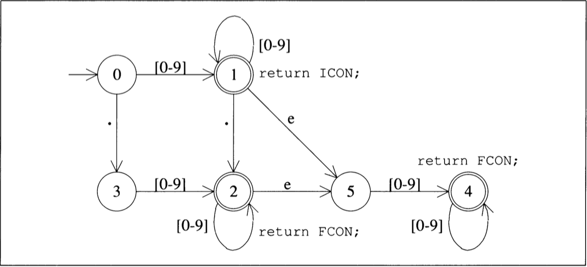
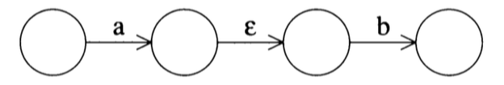
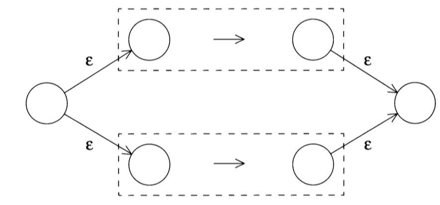
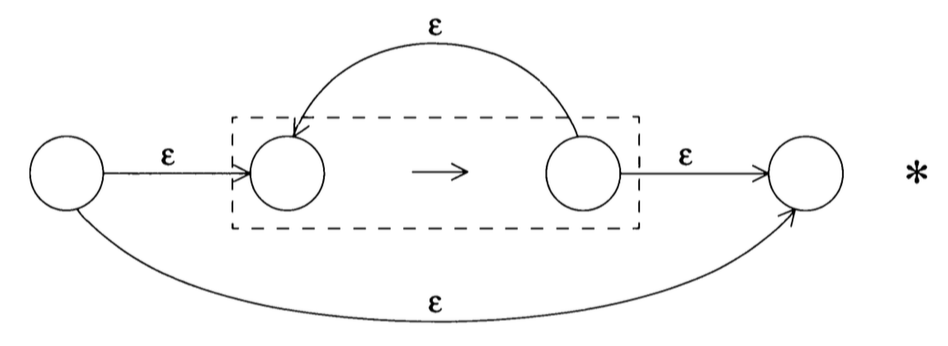
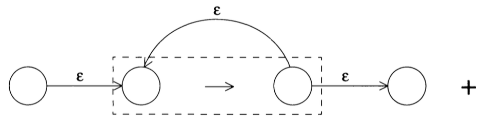
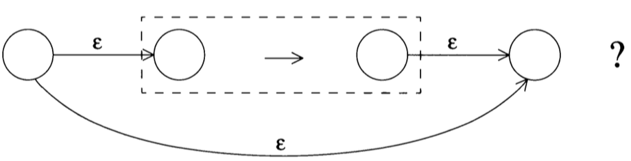

# Compiler
练习和实践编译原理、虚拟机、AOT、JIT。

# Pythonvm

用简单直白的方式实现python虚拟机各种特性，用于学习和研究。

```shell
cd pythonvm
mkdir build 
cd build
cmake ..
make
./test ../test_enclosing.pyc
```

## commit列表

整理虚拟机每个特性实现相关的commit便于学习。

### 垃圾回收

> [实现copy gc算法框架和主流程](https://github.com/luoxuwei/Compiler/commit/66ba28b73fdc4a47cb9fc3816cd9a2b03df4da3a) | [完成垃圾回收遍历算法和根节点遍历](https://github.com/luoxuwei/Compiler/commit/26a889b2d078b4b8ee92fa4485ff719163ea271d) | [处理普通对象](https://github.com/luoxuwei/Compiler/commit/f1915093e7cdccad5ae43c274227cbe5f5bf99de) | [回收List和Map](https://github.com/luoxuwei/Compiler/commit/f30d516a24ed9a2d96612cf4cfc905573fec04f8) | [在堆中创建对象](https://github.com/luoxuwei/Compiler/commit/13dbbd5e446fcfabba8d48bf039e85cacc909264) | [bugfix](https://github.com/luoxuwei/Compiler/commit/11d8275d893eed6875f665df71f070f770f6a021) |  [bugfix](https://github.com/luoxuwei/Compiler/commit/393c01e498725b17c51de2361c81dc3c2d11f70b)  | [bubfix: PyObject oops_do 中调用错了klass的oops_do方法](https://github.com/luoxuwei/Compiler/commit/b8df018b0002d93dbf5dc04e3c94f3087c68f6b7)  | [bugfix: IntegerKlass的mod方法实现方式会导致gc引起的除o异常](https://github.com/luoxuwei/Compiler/commit/67cab5656c0b3c8d3e0a424334fd339f97001cba) | [fixbug: 执行BINARY_MODULO指令时IntegerKlass mod操作触发gc会导致PUSH入栈调用的是gc前的PyList](https://github.com/luoxuwei/Compiler/commit/9b126b978ca6a346f2fa29e9fa4b0861a8d4a48c) | [fixbug:忘记处理CodeObject的内存回收，导致gc后所有引用的堆内对象的内存都被置为0，会直接退出解释执行流程](https://github.com/luoxuwei/Compiler/commit/9915ad8fdcb1bd688cce1608a04d1d9aa804027b) 

### 类和对象

> [实现type object](https://github.com/luoxuwei/Compiler/commit/90ef7a3d961dc173121e4ef784946188afdf5a9a) | [实现isinstance函数](https://github.com/luoxuwei/Compiler/commit/0ffad833427e890654b270abe57d620dd7aad36e) | [实现type函数](https://github.com/luoxuwei/Compiler/commit/7e9d55c161129e02375f1d73a271a364eae404a6) | [实现通过类型创建对象的机制](https://github.com/luoxuwei/Compiler/commit/dead36a75dc9def335e25d3e24b298f2ccabb8fa) | [添加__name__局部变量](https://github.com/luoxuwei/Compiler/commit/5d1321ed5a78e8ff91d6d083f0418638f8776a74) | [将部分list和map替换成pyobject](https://github.com/luoxuwei/Compiler/commit/7ea9639773c0a4e317fc68fb8121c751a41fe333) | [实现自定义类型](https://github.com/luoxuwei/Compiler/commit/ae9fa5fdb80d2cd01c0795139c6edda21a4323ac) | [动态设置对象属性](https://github.com/luoxuwei/Compiler/commit/3817a58fbbac4057570d7d4c22a5b086ae18011a) | [添加类方法的测试用例](https://github.com/luoxuwei/Compiler/commit/9dbfdb241e6c7a428a61e0bcc78c7f7c32a2ff53) | [实现类的构造方法](https://github.com/luoxuwei/Compiler/commit/85cc6770b687dc4fc9564fd085147f3d42e2f61c) | [对象属性](https://github.com/luoxuwei/Compiler/commit/701b3ed8363768f0d6bbd32cf49961be7175bdbf) | [修复类方法调用bug，添加bound function 和 unbound function 测试用例](https://github.com/luoxuwei/Compiler/commit/babfa7bb835b0845787e6fbaa6fae9b1ca173b3c) | [实现操作符重载](https://github.com/luoxuwei/Compiler/commit/fee86f2326b8b3fe7a0a64523d1739431115c182) | [实现内建函数重载](https://github.com/luoxuwei/Compiler/commit/8731bc3097122a32e8c3dd98f04851c6425ce934) | [函数调用操作符](https://github.com/luoxuwei/Compiler/commit/647812172edd761c060da79dd5b1300de5a17b47) | [实现取下标](https://github.com/luoxuwei/Compiler/commit/003755f95706595b2512f6904a3a98fb91fd7257) | [完成取属性机制](https://github.com/luoxuwei/Compiler/commit/819ceac03ebd688608bdd8f01ca205e703b06c07) | [实现类继承](https://github.com/luoxuwei/Compiler/commit/f99c7fd62f83c4ae2c0f4cf4bac013a157206ac3)

### 列表和字典

> [开发内建列表类型](https://github.com/luoxuwei/Compiler/commit/df897be4c2cd953440aa5f7476520e9b375c251b) | [开发列表取下标的功能](https://github.com/luoxuwei/Compiler/commit/08eea4a74c1304e26919f0ccd7026e2fe2cac8a6) | [实现查找 in 和 not in 指令](https://github.com/luoxuwei/Compiler/commit/6a1c49b0fadf68a508026e4ec64abc2004c350e4) | [开发python 内置list 的append方法](https://github.com/luoxuwei/Compiler/commit/2a2fca7f7d00ecd39ccd9e94bcd4a76daf817fcd) | [实现list通过下标修改的机制](https://github.com/luoxuwei/Compiler/commit/735a3fdee973570f37ce4bc9dc97e9961c5a0db6) | [实现list index 方法](https://github.com/luoxuwei/Compiler/commit/d8533387739aabebd306deeac4c997ea91f2d168) | [实现list pop方法](https://github.com/luoxuwei/Compiler/commit/e127a1761930c2c6bb806806cd87e6d3eb82635c) | [实现list del 指令](https://github.com/luoxuwei/Compiler/commit/12efc747ebe05a94800302f4d8c21418848c018d) | [实现list remove方法](https://github.com/luoxuwei/Compiler/commit/a924a1b85b51eefac04862b88bd8dddd552827f2) | [实现list reverse方法](https://github.com/luoxuwei/Compiler/commit/ba74f30caa38e0fa7ae53e7a24062600a2a5ea26) | [开发list sort方法](https://github.com/luoxuwei/Compiler/commit/03af2beee4e614d604d7289c91bea093d6e58dd7) | [实现迭代器](https://github.com/luoxuwei/Compiler/commit/e0aea93965606b8214be594a0778acc577c65829) | [保存频繁使用的字符串, 避免重复创建销毁](https://github.com/luoxuwei/Compiler/commit/51973e3fcf43295be359c24257cab50a53cfd8c4) | [实现list add 方法](https://github.com/luoxuwei/Compiler/commit/ca150276fa02aa3c56a5be86a8407d2a7b6212b5) | [实现list mul方法](https://github.com/luoxuwei/Compiler/commit/a06eb23ac3bf142aa7460b58f924948a9483e095) | [实现字典定义相关机制](https://github.com/luoxuwei/Compiler/commit/bc9502ea5f4b198b48af8ace2cf3b30025125453) | [实现dict setdefault方法](https://github.com/luoxuwei/Compiler/commit/95112701a28e727499bad6a2f60c80699c08105e) | [实现字典删除机制](https://github.com/luoxuwei/Compiler/commit/480405fc4dae6f3b1d5492350481fc34ff21a72a) | [实现dict keys方法](https://github.com/luoxuwei/Compiler/commit/118e29d7c3bd685f18738b31e806f581bd2bea68) | [实现dict value方法](https://github.com/luoxuwei/Compiler/commit/b75ef402133ea8050585ee16f352ab326f772eb7) | [实现dict items方法和unpack sequence 指令](https://github.com/luoxuwei/Compiler/commit/6530eed303f4452640595084b824817c512b8d54) | [实现dict遍历](https://github.com/luoxuwei/Compiler/commit/d9d996e483f6ce39282f24a2f86146920ac25faf) | [实现函数扩展参数](https://github.com/luoxuwei/Compiler/commit/1873e29f01e83c1d4b87ce0507ff3beda43fbbb0) | [实现闭包](https://github.com/luoxuwei/Compiler/commit/1ec04f080b23083fa99e90784054d2a533370a02) | 

### 函数和方法

> [开发函数执行的栈帧FrameObject](https://github.com/luoxuwei/Compiler/commit/56b62c62f23841987d7bf91bff9b6df31aeb4963) | [条件判断错误，坑死人，只能单步调试一步一步分析](https://github.com/luoxuwei/Compiler/commit/97717f4a39ea69c4e5de4580e6341e50547426dc) | [实现makefunction指令执行](https://github.com/luoxuwei/Compiler/commit/9dcd034b77cfddf026f346c93ef7b247ed126ee2) | [实现call function 和 return value 指令](https://github.com/luoxuwei/Compiler/commit/00b3615bcc8bfaa37651df5a74d02531522ff1b3) | [开发全局变量和builtin变量机制](https://github.com/luoxuwei/Compiler/commit/1fe693962bf4827d86b151404bdf10c8de467c08) |  [实现函数传参机制](https://github.com/luoxuwei/Compiler/commit/91728350cedf835fb116b62f501d7a3b0ad8fe48) | [实现函数默认参数机制](https://github.com/luoxuwei/Compiler/commit/fb383d1452af15db97d0149c08014d74e0842e13) | [实现native函数机制](https://github.com/luoxuwei/Compiler/commit/3dc5ec4c0b98ab4c49a7464d0027459e429bc6fa) | [开发类方法调研机制](https://github.com/luoxuwei/Compiler/commit/bcfbcdef96d394f0b78bfc2b6e07828a60c3f858)

### 基本数据类型

> [使用Klcass Oop二元结构实现类机制](https://github.com/luoxuwei/Compiler/commit/d70848c7fb9f2effe74aa716f178ff50e01620a3) | [完成整数和string改造](https://github.com/luoxuwei/Compiler/commit/b99ba3542e9f1081ffd82f88210dc273cf73b766)

### 控制流

> [创建解析器,搭建基础执行逻辑](https://github.com/luoxuwei/Compiler/commit/33e04ddc3554a768eb111cbce6c8f3f65aa7e567) | [完成加和print指令执行](https://github.com/luoxuwei/Compiler/commit/0baadf6ec5b83624b1bccd1cc7c98a021681b20b) | [完成分支结构所需字节码解析执行](https://github.com/luoxuwei/Compiler/commit/c3ba781830ca68401c4821ad0b31f1559362dcb2) | [实现全局的true false none](https://github.com/luoxuwei/Compiler/commit/b3beacc3f7ec7792b2e67afe16cb74122b08d45b) | [实现map](https://github.com/luoxuwei/Compiler/commit/6b91b47ccc22d9e0d80439887df4f5543daf5174) | [修复map实现的bug，主要是get时比较key是否相等的逻辑错误](https://github.com/luoxuwei/Compiler/commit/4a3a5c5c9b6b35557e8b39fef9edafe94746e387) | [实现string equal方法，不然无法用作map的key](https://github.com/luoxuwei/Compiler/commit/71c9a24adde05bf8047e7ed55f416f239573ee82) | [开发while循环和变量指令执行功能](https://github.com/luoxuwei/Compiler/commit/fb7801347bfa553fab1540523029c233ffbb7112) | [实现break语句](https://github.com/luoxuwei/Compiler/commit/5d9530c9c1b7d89f629d4ae47cd79e2bc0eb7742)

### pyc文件解析

> [创建python虚拟机项目，开发文件读取模块](https://github.com/luoxuwei/Compiler/commit/310c836fbf1e50aa6a198f7a090ebb61f94eaf14) | [开发arraylist](https://github.com/luoxuwei/Compiler/commit/c0339e5206bc2b44bdb98cda3be3de93027f0485) | [定义对象基类](https://github.com/luoxuwei/Compiler/commit/18b5ff124639d0c3781677dcb56916ff697c4224) | [定义字符串类](https://github.com/luoxuwei/Compiler/commit/7e93a68afa9eba8aec83e7c7d311be080d31b9b2) | [定义整数类](https://github.com/luoxuwei/Compiler/commit/3f0a3634952034ace7860a71451a6f48aaae5677) | [定义codeobject类](https://github.com/luoxuwei/Compiler/commit/6287aea8e0e6c1efd2d6e6723b6be42342eeaf1f) | [定义pyc文件解析类](https://github.com/luoxuwei/Compiler/commit/269b89da49f60834046a6889650738d30e930996) | [调通项目](https://github.com/luoxuwei/Compiler/commit/b41db5867962d95995f6965d679af5b29df40aa5) | [完成读取字节码](https://github.com/luoxuwei/Compiler/commit/1d5df16e89b55f477ce5e1b35cdef9f39578c19f) | [解析常量列表，完成int和string类型数据的读取](https://github.com/luoxuwei/Compiler/commit/bb8f3ae6312d16a34a6f6d1e71f1509fac235a8a) | [补充元组几种数据类型的解析](https://github.com/luoxuwei/Compiler/commit/398153802a7e0cad88b1daec57b9df59171c702d) | [定义字节码](https://github.com/luoxuwei/Compiler/commit/80eae31f44b801511c6d4f95dc8f07443b91f114) | [完善codeobject解析](https://github.com/luoxuwei/Compiler/commit/42336c8b1b29a7eafcc0b60cb36eb34c401e957f)

# parser

自己动手实现编译前端词法解析语法分析相关算法

## 词法分析

通常都是用‘硬编码’的方式实现，特定语言的编译器前端都是这种方式，比如javac gcc clang等。为了更通用可以使用模式识别匹配算法，也就是正则表达式。为了研究算法，这里主要关注正则表达式的实现。
### 使用有限状态机实现整形和浮点型数值识别器


```shell
cd parser/FinitStateMachine
mkdir build
cd build
cmake ..
make
./FinitStateMachine 123.45
```

####  commit

> [定义词法分析模块接口](https://github.com/luoxuwei/Compiler/commit/9d1e26cbe21a0034685b0aae642c56ed649e7076) | [完成词法解析简单实现](https://github.com/luoxuwei/Compiler/commit/a613cd5ac6895f48408e536919482757b4181836) | [定义有限自动机接口](https://github.com/luoxuwei/Compiler/commit/c47128b8414aaeb8b0c1b7d587a1df50474274e7) | [完成状态机状态初始化](https://github.com/luoxuwei/Compiler/commit/3f354d6a05f93d00ff12b6756e90226775c6aaa8) | [完成状态装换逻辑](https://github.com/luoxuwei/Compiler/commit/f909562c492c8464d36f3a4da4be4e87d294f2c5) | [搭建有限状态自动机执行流程](https://github.com/luoxuwei/Compiler/commit/4c94d5745c881929a35f9213ac121adec087cb1e) | [完成状态机识别逻辑](https://github.com/luoxuwei/Compiler/commit/e93b553dee4d93856af21874cd3cb6c80d2044f5) 

## 将正则表达式转换为有限状态自动机

大多数正则表达式识别程序，基本上都是先将其转换为自动机，然后通过驱动自动机来识别输入的，一般是将正则表达式转换为NFA, 将NFA转换为DFA。将正则表达式转换为NFA的算法是由贝尔实验室的Ken Thompson 给出的。连接表达式ab 可以表示如下：



两个表达式进行 OR操作的时候 |  构造图如下：



exp* 的NFA:

如果是自我从复0次，那直接从下面的边走到末尾节点。



exp+（至少重复一次） 的NFA:



exp? (重复0或1次)的NFA:



任何复杂的正则表达式它的NFA的构造都是上面几种构造的组合
