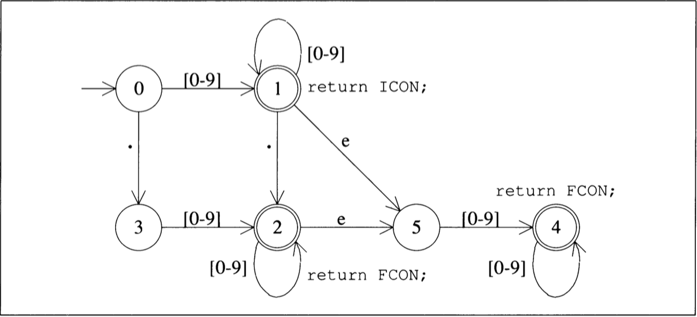
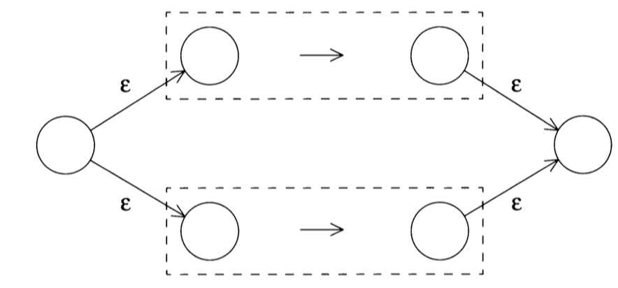
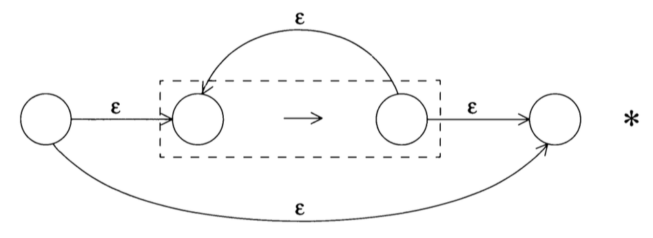
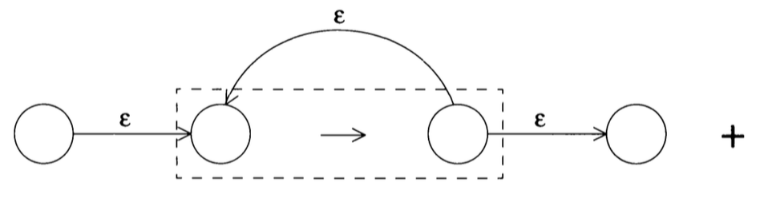
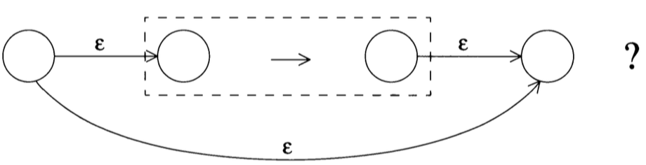

- [简介](#简介)
  * [项目列表](#项目列表)
- [Pythonvm](#pythonvm)
  * [commit列表](#commit列表)
    + [垃圾回收](#垃圾回收)
    + [类和对象](#类和对象)
    + [列表和字典](#列表和字典)
    + [函数和方法](#函数和方法)
    + [基本数据类型](#基本数据类型)
    + [控制流](#控制流)
    + [pyc文件解析](#pyc文件解析)
- [parser](#parser)
  * [词法分析](#词法分析)
    + [使用有限状态机实现整形和浮点型数值识别器](#使用有限状态机实现整形和浮点型数值识别器)
      - [commit](#commit)
  * [正则表达式](#正则表达式)
    + [将正则表达式转换为有限状态自动机](#将正则表达式转换为有限状态自动机)
    + [宏替换](#宏替换)
      - [commit](#commit-1)
    + [正则表达式词法解析](#正则表达式词法解析)
      - [commit](#commit-2)
    + [构造简单的正则表达式对应的NFA状态机](#构造简单的正则表达式对应的NFA状态机)
      - [commit](#commit-3)
    + [构建复杂的正则表达式对应的NFA状态机（闭包连接OR）](#构建复杂的正则表达式对应的NFA状态机)
      - [commit](#commit-4)
    + [NFA 状态机识别字符串](#NFA状态机识别字符串)
      - [commit](#commit-5)
    + [NFA转DFA](#NFA转DFA)
      - [commit](#commit-6)
    + [DFA最小化](#DFA最小化)
      - [commit](#commit-7)
    + [后续](#后续)
  * [语法分析](#语法分析)
- [自低向上的语法解析](#自低向上的语法解析)
  * [commit](#commit-8)
- [C语言编译器](#C语言编译器)
  * [commit](#commit-9)
- [C语言解释器](#C语言解释器)
  * [commit](#commit-10)
- [c2j](#c2j)
  * [commit](#commit-11)

# 简介

练习和实践编译原理、虚拟机、AOT、JIT。

## 项目列表

[pythonvm:](./pythonvm) python 2 虚拟机

[Parser:](./Parser) 自低向上的语法解析引擎

[regex:](./regex) 正则表达式引擎

[c_compiler:](./c_compiler) C语言编译器

[c_interpretor:](./c_interpretor) C语言解释器

[c2j:](./c2j) 将C语言代码编译成java汇编代码

# Pythonvm

用简单直白的方式实现python虚拟机各种特性，用于学习和研究。

```shell
cd pythonvm
mkdir build 
cd build
cmake ..
make
./test ../test_case/24_test_enclosing.pyc
```

## commit列表

整理虚拟机每个特性实现相关的commit便于学习。

### 垃圾回收

> [实现copy gc算法框架和主流程](https://github.com/luoxuwei/Compiler/commit/66ba28b73fdc4a47cb9fc3816cd9a2b03df4da3a) | [完成垃圾回收遍历算法和根节点遍历](https://github.com/luoxuwei/Compiler/commit/26a889b2d078b4b8ee92fa4485ff719163ea271d) | [处理普通对象](https://github.com/luoxuwei/Compiler/commit/f1915093e7cdccad5ae43c274227cbe5f5bf99de) | [回收List和Map](https://github.com/luoxuwei/Compiler/commit/f30d516a24ed9a2d96612cf4cfc905573fec04f8) | [在堆中创建对象](https://github.com/luoxuwei/Compiler/commit/13dbbd5e446fcfabba8d48bf039e85cacc909264) | [bugfix](https://github.com/luoxuwei/Compiler/commit/11d8275d893eed6875f665df71f070f770f6a021) |  [bugfix](https://github.com/luoxuwei/Compiler/commit/393c01e498725b17c51de2361c81dc3c2d11f70b)  | [bubfix: PyObject oops_do 中调用错了klass的oops_do方法](https://github.com/luoxuwei/Compiler/commit/b8df018b0002d93dbf5dc04e3c94f3087c68f6b7)  | [bugfix: IntegerKlass的mod方法实现方式会导致gc引起的除o异常](https://github.com/luoxuwei/Compiler/commit/67cab5656c0b3c8d3e0a424334fd339f97001cba) | [fixbug: 执行BINARY_MODULO指令时IntegerKlass mod操作触发gc会导致PUSH入栈调用的是gc前的PyList](https://github.com/luoxuwei/Compiler/commit/9b126b978ca6a346f2fa29e9fa4b0861a8d4a48c) | [fixbug:忘记处理CodeObject的内存回收，导致gc后所有引用的堆内对象的内存都被置为0，会直接退出解释执行流程](https://github.com/luoxuwei/Compiler/commit/9915ad8fdcb1bd688cce1608a04d1d9aa804027b) 

### 类和对象

> [实现type object](https://github.com/luoxuwei/Compiler/commit/90ef7a3d961dc173121e4ef784946188afdf5a9a) | [实现isinstance函数](https://github.com/luoxuwei/Compiler/commit/0ffad833427e890654b270abe57d620dd7aad36e) | [实现type函数](https://github.com/luoxuwei/Compiler/commit/7e9d55c161129e02375f1d73a271a364eae404a6) | [实现通过类型创建对象的机制](https://github.com/luoxuwei/Compiler/commit/dead36a75dc9def335e25d3e24b298f2ccabb8fa) | [添加__name__局部变量](https://github.com/luoxuwei/Compiler/commit/5d1321ed5a78e8ff91d6d083f0418638f8776a74) | [将部分list和map替换成pyobject](https://github.com/luoxuwei/Compiler/commit/7ea9639773c0a4e317fc68fb8121c751a41fe333) | [实现自定义类型](https://github.com/luoxuwei/Compiler/commit/ae9fa5fdb80d2cd01c0795139c6edda21a4323ac) | [动态设置对象属性](https://github.com/luoxuwei/Compiler/commit/3817a58fbbac4057570d7d4c22a5b086ae18011a) | [添加类方法的测试用例](https://github.com/luoxuwei/Compiler/commit/9dbfdb241e6c7a428a61e0bcc78c7f7c32a2ff53) | [实现类的构造方法](https://github.com/luoxuwei/Compiler/commit/85cc6770b687dc4fc9564fd085147f3d42e2f61c) | [对象属性](https://github.com/luoxuwei/Compiler/commit/701b3ed8363768f0d6bbd32cf49961be7175bdbf) | [修复类方法调用bug，添加bound function 和 unbound function 测试用例](https://github.com/luoxuwei/Compiler/commit/babfa7bb835b0845787e6fbaa6fae9b1ca173b3c) | [实现操作符重载](https://github.com/luoxuwei/Compiler/commit/fee86f2326b8b3fe7a0a64523d1739431115c182) | [实现内建函数重载](https://github.com/luoxuwei/Compiler/commit/8731bc3097122a32e8c3dd98f04851c6425ce934) | [函数调用操作符](https://github.com/luoxuwei/Compiler/commit/647812172edd761c060da79dd5b1300de5a17b47) | [实现取下标](https://github.com/luoxuwei/Compiler/commit/003755f95706595b2512f6904a3a98fb91fd7257) | [完成取属性机制](https://github.com/luoxuwei/Compiler/commit/819ceac03ebd688608bdd8f01ca205e703b06c07) | [实现类继承](https://github.com/luoxuwei/Compiler/commit/f99c7fd62f83c4ae2c0f4cf4bac013a157206ac3)

### 列表和字典

> [开发内建列表类型](https://github.com/luoxuwei/Compiler/commit/df897be4c2cd953440aa5f7476520e9b375c251b) | [开发列表取下标的功能](https://github.com/luoxuwei/Compiler/commit/08eea4a74c1304e26919f0ccd7026e2fe2cac8a6) | [实现查找 in 和 not in 指令](https://github.com/luoxuwei/Compiler/commit/6a1c49b0fadf68a508026e4ec64abc2004c350e4) | [开发python 内置list 的append方法](https://github.com/luoxuwei/Compiler/commit/2a2fca7f7d00ecd39ccd9e94bcd4a76daf817fcd) | [实现list通过下标修改的机制](https://github.com/luoxuwei/Compiler/commit/735a3fdee973570f37ce4bc9dc97e9961c5a0db6) | [实现list index 方法](https://github.com/luoxuwei/Compiler/commit/d8533387739aabebd306deeac4c997ea91f2d168) | [实现list pop方法](https://github.com/luoxuwei/Compiler/commit/e127a1761930c2c6bb806806cd87e6d3eb82635c) | [实现list del 指令](https://github.com/luoxuwei/Compiler/commit/12efc747ebe05a94800302f4d8c21418848c018d) | [实现list remove方法](https://github.com/luoxuwei/Compiler/commit/a924a1b85b51eefac04862b88bd8dddd552827f2) | [实现list reverse方法](https://github.com/luoxuwei/Compiler/commit/ba74f30caa38e0fa7ae53e7a24062600a2a5ea26) | [开发list sort方法](https://github.com/luoxuwei/Compiler/commit/03af2beee4e614d604d7289c91bea093d6e58dd7) | [实现迭代器](https://github.com/luoxuwei/Compiler/commit/e0aea93965606b8214be594a0778acc577c65829) | [保存频繁使用的字符串, 避免重复创建销毁](https://github.com/luoxuwei/Compiler/commit/51973e3fcf43295be359c24257cab50a53cfd8c4) | [实现list add 方法](https://github.com/luoxuwei/Compiler/commit/ca150276fa02aa3c56a5be86a8407d2a7b6212b5) | [实现list mul方法](https://github.com/luoxuwei/Compiler/commit/a06eb23ac3bf142aa7460b58f924948a9483e095) | [实现字典定义相关机制](https://github.com/luoxuwei/Compiler/commit/bc9502ea5f4b198b48af8ace2cf3b30025125453) | [实现dict setdefault方法](https://github.com/luoxuwei/Compiler/commit/95112701a28e727499bad6a2f60c80699c08105e) | [实现字典删除机制](https://github.com/luoxuwei/Compiler/commit/480405fc4dae6f3b1d5492350481fc34ff21a72a) | [实现dict keys方法](https://github.com/luoxuwei/Compiler/commit/118e29d7c3bd685f18738b31e806f581bd2bea68) | [实现dict value方法](https://github.com/luoxuwei/Compiler/commit/b75ef402133ea8050585ee16f352ab326f772eb7) | [实现dict items方法和unpack sequence 指令](https://github.com/luoxuwei/Compiler/commit/6530eed303f4452640595084b824817c512b8d54) | [实现dict遍历](https://github.com/luoxuwei/Compiler/commit/d9d996e483f6ce39282f24a2f86146920ac25faf) | [实现函数扩展参数](https://github.com/luoxuwei/Compiler/commit/1873e29f01e83c1d4b87ce0507ff3beda43fbbb0) | [实现闭包](https://github.com/luoxuwei/Compiler/commit/1ec04f080b23083fa99e90784054d2a533370a02) | 

### 函数和方法

> [开发函数执行的栈帧FrameObject](https://github.com/luoxuwei/Compiler/commit/56b62c62f23841987d7bf91bff9b6df31aeb4963) | [条件判断错误，坑死人，只能单步调试一步一步分析](https://github.com/luoxuwei/Compiler/commit/97717f4a39ea69c4e5de4580e6341e50547426dc) | [实现makefunction指令执行](https://github.com/luoxuwei/Compiler/commit/9dcd034b77cfddf026f346c93ef7b247ed126ee2) | [实现call function 和 return value 指令](https://github.com/luoxuwei/Compiler/commit/00b3615bcc8bfaa37651df5a74d02531522ff1b3) | [开发全局变量和builtin变量机制](https://github.com/luoxuwei/Compiler/commit/1fe693962bf4827d86b151404bdf10c8de467c08) |  [实现函数传参机制](https://github.com/luoxuwei/Compiler/commit/91728350cedf835fb116b62f501d7a3b0ad8fe48) | [实现函数默认参数机制](https://github.com/luoxuwei/Compiler/commit/fb383d1452af15db97d0149c08014d74e0842e13) | [实现native函数机制](https://github.com/luoxuwei/Compiler/commit/3dc5ec4c0b98ab4c49a7464d0027459e429bc6fa) | [开发类方法调研机制](https://github.com/luoxuwei/Compiler/commit/bcfbcdef96d394f0b78bfc2b6e07828a60c3f858)

### 基本数据类型

> [使用Klcass Oop二元结构实现类机制](https://github.com/luoxuwei/Compiler/commit/d70848c7fb9f2effe74aa716f178ff50e01620a3) | [完成整数和string改造](https://github.com/luoxuwei/Compiler/commit/b99ba3542e9f1081ffd82f88210dc273cf73b766)

### 控制流

> [创建解析器,搭建基础执行逻辑](https://github.com/luoxuwei/Compiler/commit/33e04ddc3554a768eb111cbce6c8f3f65aa7e567) | [完成加和print指令执行](https://github.com/luoxuwei/Compiler/commit/0baadf6ec5b83624b1bccd1cc7c98a021681b20b) | [完成分支结构所需字节码解析执行](https://github.com/luoxuwei/Compiler/commit/c3ba781830ca68401c4821ad0b31f1559362dcb2) | [实现全局的true false none](https://github.com/luoxuwei/Compiler/commit/b3beacc3f7ec7792b2e67afe16cb74122b08d45b) | [实现map](https://github.com/luoxuwei/Compiler/commit/6b91b47ccc22d9e0d80439887df4f5543daf5174) | [修复map实现的bug，主要是get时比较key是否相等的逻辑错误](https://github.com/luoxuwei/Compiler/commit/4a3a5c5c9b6b35557e8b39fef9edafe94746e387) | [实现string equal方法，不然无法用作map的key](https://github.com/luoxuwei/Compiler/commit/71c9a24adde05bf8047e7ed55f416f239573ee82) | [开发while循环和变量指令执行功能](https://github.com/luoxuwei/Compiler/commit/fb7801347bfa553fab1540523029c233ffbb7112) | [实现break语句](https://github.com/luoxuwei/Compiler/commit/5d9530c9c1b7d89f629d4ae47cd79e2bc0eb7742)

### pyc文件解析

> [创建python虚拟机项目，开发文件读取模块](https://github.com/luoxuwei/Compiler/commit/310c836fbf1e50aa6a198f7a090ebb61f94eaf14) | [开发arraylist](https://github.com/luoxuwei/Compiler/commit/c0339e5206bc2b44bdb98cda3be3de93027f0485) | [定义对象基类](https://github.com/luoxuwei/Compiler/commit/18b5ff124639d0c3781677dcb56916ff697c4224) | [定义字符串类](https://github.com/luoxuwei/Compiler/commit/7e93a68afa9eba8aec83e7c7d311be080d31b9b2) | [定义整数类](https://github.com/luoxuwei/Compiler/commit/3f0a3634952034ace7860a71451a6f48aaae5677) | [定义codeobject类](https://github.com/luoxuwei/Compiler/commit/6287aea8e0e6c1efd2d6e6723b6be42342eeaf1f) | [定义pyc文件解析类](https://github.com/luoxuwei/Compiler/commit/269b89da49f60834046a6889650738d30e930996) | [调通项目](https://github.com/luoxuwei/Compiler/commit/b41db5867962d95995f6965d679af5b29df40aa5) | [完成读取字节码](https://github.com/luoxuwei/Compiler/commit/1d5df16e89b55f477ce5e1b35cdef9f39578c19f) | [解析常量列表，完成int和string类型数据的读取](https://github.com/luoxuwei/Compiler/commit/bb8f3ae6312d16a34a6f6d1e71f1509fac235a8a) | [补充元组几种数据类型的解析](https://github.com/luoxuwei/Compiler/commit/398153802a7e0cad88b1daec57b9df59171c702d) | [定义字节码](https://github.com/luoxuwei/Compiler/commit/80eae31f44b801511c6d4f95dc8f07443b91f114) | [完善codeobject解析](https://github.com/luoxuwei/Compiler/commit/42336c8b1b29a7eafcc0b60cb36eb34c401e957f)

# parser

自己动手实现编译前端词法解析语法分析相关算法

## 词法分析

通常都是用‘硬编码’的方式实现，特定语言的编译器前端都是这种方式，比如javac gcc clang等。为了更通用可以使用模式识别匹配算法，定义自己的词法规则，就可以支持多种语言的词法分析，最终可以做成*Flex*这样的项目，生成词法解析器。其中用到的技术就是正则表达式。为了研究算法，这里主要关注正则表达式的实现。
### 使用有限状态机实现整形和浮点型数值识别器


```shell
cd FinitStateMachine
mkdir build
cd build
cmake ..
make
./FinitStateMachine 123.45
```

####  commit

> [定义词法分析模块接口](https://github.com/luoxuwei/Compiler/commit/9d1e26cbe21a0034685b0aae642c56ed649e7076) | [完成词法解析简单实现](https://github.com/luoxuwei/Compiler/commit/a613cd5ac6895f48408e536919482757b4181836) | [定义有限自动机接口](https://github.com/luoxuwei/Compiler/commit/c47128b8414aaeb8b0c1b7d587a1df50474274e7) | [完成状态机状态初始化](https://github.com/luoxuwei/Compiler/commit/3f354d6a05f93d00ff12b6756e90226775c6aaa8) | [完成状态装换逻辑](https://github.com/luoxuwei/Compiler/commit/f909562c492c8464d36f3a4da4be4e87d294f2c5) | [搭建有限状态自动机执行流程](https://github.com/luoxuwei/Compiler/commit/4c94d5745c881929a35f9213ac121adec087cb1e) | [完成状态机识别逻辑](https://github.com/luoxuwei/Compiler/commit/e93b553dee4d93856af21874cd3cb6c80d2044f5) 
## 正则表达式
### 将正则表达式转换为有限状态自动机

大多数正则表达式识别程序，基本上都是先将其转换为自动机，然后通过驱动自动机来识别输入的，一般是将正则表达式转换为NFA, 将NFA转换为DFA。将正则表达式转换为NFA的算法是由贝尔实验室的Ken Thompson 给出的。连接表达式ab 可以表示如下：


两个表达式进行 OR操作的时候 |  构造图如下：



exp* 的NFA:

如果是自我从复0次，那直接从下面的边走到末尾节点。



exp+（至少重复一次） 的NFA:



exp? (重复0或1次)的NFA:



任何复杂的正则表达式它的NFA的构造都是上面几种构造的组合

### 宏替换

宏定义即：D [0-9]在转换前，需要将正则表达式中的宏进行替换，也就是要将{D}+转换成：{[0-9]}。它有一个难点是需要处理宏定义的间套情况，例如：

D [0-9]

A [a-z] 

AD {D}|{A}

替换了宏AD之后，还需要继续替换D 和A.

```shell
cd regex
mkdir build
cd build
cmake ..
make
./regex ../test_macro.txt {AD}.{AD}+
```

#### commit

> [创建正则表达式项目](https://github.com/luoxuwei/Compiler/commit/07190377a064d8fefe7cea8b3f9aaa02b45b5f20) | [开发宏扩展功能](https://github.com/luoxuwei/Compiler/commit/ef823601d26d48be8c244200d4f145401ebe49e1) | [开发正则表达式宏预处理逻辑](https://github.com/luoxuwei/Compiler/commit/bffec863281ec6fa1ac081812c82a3a43e49c700) | [项目重构](https://github.com/luoxuwei/Compiler/commit/e2502d62935eebd85a22082b2a0637bbd1eeb356) | [重构LexerBuffer](https://github.com/luoxuwei/Compiler/commit/9e58e8784b1bba8faf4ff5663b5738a831c3ff57) | [将词法解析逻辑封装到单独模块](https://github.com/luoxuwei/Compiler/commit/8bc575916d0e2bc8c2cd5c7d4746f4f3b7f97026)

### 正则表达式词法解析

正则表达式其实是由一组由普通字符和特殊字符组合而成的一种表达形式。特殊的字符有特殊的含义，在正则表达式中，特殊字符有：\+ ? { } [ ] ( )  .  ^  $  “ \ 。普通字符和特殊字符结合在一起时，需要进行不同的解读，正则表达式词法解析麻烦的就是处理这种情况。

```shell
cd regex
mkdir build
cd build
cmake ..
make
./regex ../test_macro.txt {AD}.{AD}+
# ./regex ../test_macro.txt "[\b\r\n]"
# ./regex ../test_macro.txt [\"+*?\"]
# ./regex ../test_macro.txt [\\x1F]
```

#### commit

> [开发正则表达式词法解析逻辑](https://github.com/luoxuwei/Compiler/commit/6387ccc84661ea3daa040384da7f6ff30e7995ee) | [开发正则表达式词法解析功能测试逻辑](https://github.com/luoxuwei/Compiler/commit/a71f19b3ffb5575d2ac4a19b592347d3ab7c713f) | 

### 构造简单的正则表达式对应的NFA状态机

```
term ->  character | [...] | [^...]
```

任何复杂的形式，都建立在多种简单的形式组合之上。

```shell
cd regex
mkdir build
cd build
cmake ..
make
# 单字符
./regex ../test_macro.txt a
# 匹配任意字符
# ./regex ../test_macro.txt .
# 字符集匹配
#./regex ../test_macro.txt [a-zA-Z]
# 字符集取反
# ./regex ../test_macro.txt [^a-zA-Z]
```

#### commit

> [开发构造nfa需要的基础数据结构和状态节点管理模块](https://github.com/luoxuwei/Compiler/commit/fb0fe680398dfc2cde3b9f1536d0fca8b462efd7) | [开发单字符匹配规则构造](https://github.com/luoxuwei/Compiler/commit/74d2429e4f7fba67895d02d61a3bc4e57b0ee4a5) | [开发正则表达式‘.’匹配规则构造逻辑](https://github.com/luoxuwei/Compiler/commit/df0a4b8754d6dd6edd828e04f0e06a6a8b3f1ec8) | [开发正则表达式字符集构造逻辑](https://github.com/luoxuwei/Compiler/commit/eb63f2e8bc2e528c08103125be23d5fc2b8f3339) | [开发正则表达式字符集取反逻辑](https://github.com/luoxuwei/Compiler/commit/1914d75c961d6b70f6ef3e3e2f8fe4c995100d41) | [打印nfa和测试nfa构造逻辑](https://github.com/luoxuwei/Compiler/commit/8f8aaf036ae21c6779d3b753def1a5693cf1df34)

### 构建复杂的正则表达式对应的NFA状态机（闭包连接OR）

正则表达式解析语法：

expr -> expr  “|”  cat_expr

​            | cat_expr

cat_expr -> factor cat_expr

​                   | factor

factor -> term* | term+ | term?

term -> [string] | . | character | (expr) | [ ^string]

```shell
cd regex
mkdir build
cd build
cmake ..
make
# *
./regex ../test_macro.txt [0-9]*
# +
# ./regex ../test_macro.txt [0-9]+
#?
# ./regex ../test_macro.txt [0-9]?
#& 连接
# ./regex ../test_macro.txt [0-9]*[a-z]
# | OR操作
# ./regex ../test_macro.txt "[0-9]*|[a-z]+"
# ()
# ./regex ../test_macro.txt "([0-9])*|([a-z])+"

```

#### commit

> [实现正则表达式*闭包的nfa构造](https://github.com/luoxuwei/Compiler/commit/76bfbaf0ad45baaae4dad8c5d08e33d4fae89bf2) | [实现正则表达式+闭包的nfa构造](https://github.com/luoxuwei/Compiler/commit/ef99f3a0efd829336bd24a9f8baa26cb853fe4df) | [实现正则表达式？选择操作的nfa构造](https://github.com/luoxuwei/Compiler/commit/fe98389a2c1cf0d48b2383c6691d36c52af2bad5) | [将正则表达式闭包操作整合到factor中](https://github.com/luoxuwei/Compiler/commit/db7f85c8a49b66231afcadb50fcf9a1b65f10b24) | [实现正则表达式连接操作的nfa构造](https://github.com/luoxuwei/Compiler/commit/031c9f2304471317c99a157cc96051e997014450) | [实现正则表达式OR操作的nfa构造](https://github.com/luoxuwei/Compiler/commit/ebe5c11e88c05d51a14db60f784721f21a194eeb) | [实现正则表达式()处理机制](https://github.com/luoxuwei/Compiler/commit/1be16092b86195341cf3e40708459371d7e7643a)

### NFA 状态机识别字符串

对应给定的一组初始状态，通过他们的ε边所能达到的状态的集合，我们称之为ε闭包记做ε-Closure，从输入中，读入字符后，得到的跳转状态要从ε闭包集合中找能够读取字符的状态，得到转移状态集合。得到转移状态集合后，求转移状态集合的ε闭包。继续读入字符，求转移状态集合。就这样循环直到处理完所有输入字符，最终的集合中如果有接受状态就识别成功。

ε-Closure({17}) = { 5,9,17,1,3,4 }

move({5,9,17,1,3,4}, ‘1’) = {2, 10}

ε-Closure({2, 10}) = { 10,5,2,11,1,4 }.

.....

```shell
cd regex
mkdir build
cd build
cmake ..
make
./regex ../test_macro.txt "{D}*\.{D}|{D}\.{D}*"
# 控制台输入要识别的数字
#Input string:
#1.2
```

#### commit

> [实现求集合的ε-Closure](https://github.com/luoxuwei/Compiler/commit/df93ed3cf2e9c8bfe902909487f550dbe8b6ccf1) | [实现求对应字符的跳转集合](https://github.com/luoxuwei/Compiler/commit/80272b734f5a3d1c347f7d9b1ab2f69839a4ea0d) | [实现nfa 识别字符串](https://github.com/luoxuwei/Compiler/commit/e0d65da31139a8af54a80539dd60b426a81c85b5) 

### NFA转DFA

nfa转dfa的过程和使用nfa识别字符串的过程类似，先求初始状态ε-Closure，得到初始状态集合，一个nfa状态集合对应一个dfa节点，将新产生的dfa节点加入到一个列表中，然后遍历dfa节点对应nfa集合中所有状态的可接受的输入，求得每个输入的转移集合，求这些转移集合的ε-Closure，这些ε-Closure对应新的nfa节点，再将这些新的dfa节点入到列表中，加入时需要判断列表中是否已经存在同样的dfa节点（判断两个dfa节点对应的nfa集合是否相同），不存在才加入，如果存在则不产生新的dfa节点。继续求新加入的集合的转移集合，如此循环直到没有新的集合产生。

```shell
cd regex
mkdir build
cd build
cmake ..
make
./regex ../test_macro.txt "{D}*\.{D}|{D}\.{D}*"
```

#### commit

> [创建构建DFA所需的基础数据结构和dfa节点管理模块](https://github.com/luoxuwei/Compiler/commit/8df5da680f49a60199baca197c60b54b42ee2547) | [将nfa相关逻辑从regex类中挪到nfa类里](https://github.com/luoxuwei/Compiler/commit/8fe4130fad2225ee55ae66c6b439889596915ae7) | [实现nfa转dfa算法](https://github.com/luoxuwei/Compiler/commit/906484f5bf11a4debb428cf56a5f5dd0bccb52c8)

### DFA最小化

NFA转化的DFA不是最优的其中有些节点可以合并，DFA最小化就是要去掉和合并不必要的节点。

1.把所有状态节点分成两分区，接收状态为一分区，非接收状态为一分区

2.根据每一个状态节点对应输入字符后的跳转情况，进行下一步分区。将那些根据输入字符跳转到的节点不在同一分区（不在本分区）的节点切分成新的分区。

不断的迭代，直到所有分区无法再分割，根据分割后的情况，我们把点到点的转移关系转化成分区与分区的转移关系，就得到一个新的DFA。

```shell
cd regex
mkdir build
cd build
cmake ..
make
./regex ../test_macro.txt "{D}*\.{D}|{D}\.{D}*"
```

#### commit

> [实现dfa节点分区算法](https://github.com/luoxuwei/Compiler/commit/66993cda449253a40d3c159dc723b33d2f2cfdfd) | [构建最小化后的dfa的跳转表](https://github.com/luoxuwei/Compiler/commit/b6cc1aff58bf4a082b0b9d6eab8ac78d2fa0c242)

### 后续

1.使用更高效的算法 [An Efficient and Elegant Regular Expression Matcher in Python](http://morepypy.blogspot.ru/2010/05/efficient-and-elegant-regular.html).

2.使用Jit加速

3.支持更多的规则

## 语法分析

语法规则有一种固定的表现形式称之为Backus-Naur 形式，简称为 BNF. BNF 的格式化表现为，Symbol -> definition. definition 是对Symbol 的解释， 例子：

 句子 -> 主语 动词 谓语从句

具体的说，-> 左边是一个抽象概念，右边是对抽象概念的解释，解释中又可能包含抽象概念，其中包含的抽象概念又必须以 Symbol -> definition 的格式来继续展开。-> 左边的是非终结符，右边的不能再继续推导的称为终结符。这样的一条规则称为推导。语法规则包含一组有限的推导。例子：

1. 句子 -> 主语 动词 谓语从句

2. 主语 -> 名词

3. 动词 -> “看见” | “唱歌”

4. 谓语从句 -> 名词 动词

5. 名词 -> “我” | “刘德华”

给定一个句子，判断句子是否符合语法规定的过程，我们称之为语法推导。推导的过程是用-> 右边的内容去替换左边的非终结符，反复进行，直到不能继续替换为止。推导过程，我们总是从最左边开始，找到最左边的第一个非终结符，然后进行替换，这种推导方式叫 left most derivation. 简称LR. 同时，推导的过程是从最顶端的的推导表达式开始进行替换，先替换 句子， 然后替换 主语，然后替换动词，这种由上到下的过程，也叫作自顶向下的分析。

我们可以将每一个非终结符定义一个函数，替换的过程就是调用对应的函数，用计算机伪码表示是这样的：

```java
句子(buffer) {
  主语(buffer);
  动词(buffer);
  谓语从句(buffer);
}

主语(buffer) {
  名词(buffer);
}

名词(buffer) {
  if (buffer[0] == “我”) {
    buffer = buffer.substring(1);
    return;
  }
   if (buffer[0,1,2] == “刘德华”) {
     buffer = buffer.substring(3);
     return;
   }
}

动词(buffer) {
    if (buffer[0,1］== “看见” || buffer[0,1] == “唱歌") {
         buffer = buffer.substring(2);
         return; 
     }
}
```

整个解析过程形成一种树状结构，称为语法解析数。语法分析的实现如果只为特定语言服务，就可以使用以上描述的方式实现，像javac。这种方式类似“硬编码”，也可以做成一个通用的框架，实现语法分析的自动推导，只需要定义自己的语法规则，就可以支持多种语言的词法分析，最终可以做成*yacc*这样的框架可以生成语法解析器，

很多语法的推导过程，可以转换为压栈式DFA,称之为压栈式有限状态自动机(PDA)。就是DFA加一个堆栈，这个堆栈就是将解析过程函数调用隐含的堆栈调用转变为显示调用。类似用非递归方式实现二叉树后序遍历。

使用PDA做自顶向下的语法分析，在开始时，堆栈会先被压入语法推导的第一个非终结符节点，语法步骤如下：

1. 如果解析堆栈是空的，那么语法解析结束。

2. 如果栈顶端是非终结符，那么将它对应的右边推导以逆向的方式压入堆栈，例如如果有推导：

a -> b c d,那么我们先将d 压入栈，然后是c,然后是b.如果右边是ε，那么我们就将栈顶元素弹出即可。

3. 如果栈顶是终结符，那么该终结符必须与当前读入的字符匹配，若不然，则出现语法错误，如果匹配，那么将它弹出栈顶，然后转到步骤1.

DFA的作用不再是状态跳转， 当前状态（栈顶元素）和输入字符（token）不是对应跳转的下一个状态，而是对应于某个动作。这个动作一般是将指定的状态压入堆栈或弹出栈顶元素，编译器中的语义分析，代码生成等。

# 自低向上的语法解析

实现LALR(1)算法实现

```shell
cd Parser
mkdir build
cd build
cmake ..
make
./CParse ../test.c
```

执行过程每一步都会打印日志，可以通过日志查看推导和解析过程，执行完最终输出“The input can be accepted”表示正确解析。

## commit

[定义C语言变量定义相关token](https://github.com/luoxuwei/Compiler/commit/7cbef8afaff947eb1a625331385341c32c1e9245) | [创建c语言词法解析类完成初始化逻辑](https://github.com/luoxuwei/Compiler/commit/80c62371f98cf4e41ec304803310d6987bac49c1) | [完成简单的c语言变量声明语法所需词法解析](https://github.com/luoxuwei/Compiler/commit/aad12aebca55e7f2c92f135569f6533ccfb41b65) | [实现语法推导表达式的封装](https://github.com/luoxuwei/Compiler/commit/f7510f16ec7c388b0d3ecfd86935f0b13038d71b) | [实现语法推导表达式管理模块](https://github.com/luoxuwei/Compiler/commit/f17e0335d6cf2514ea152f778bb567463034a3b9) | [定义自动机状态节点](https://github.com/luoxuwei/Compiler/commit/f73f913ffb67047a378baab2a24865b91d18ae96) | [实现状态节点闭包操作](https://github.com/luoxuwei/Compiler/commit/654b2d345b491d7b8ac7924375012b7703feb8a4) | [实现状态节点语法推导表达式分区算法](https://github.com/luoxuwei/Compiler/commit/5a7f680417b8a7096d9f8fad1e41e1884e31bbc2) | [实现自动机跳转表](https://github.com/luoxuwei/Compiler/commit/f10fb7e8eed4bbcdab94fb4375c90dc59bd9498a) | [将数据初始化移到单独的模](https://github.com/luoxuwei/Compiler/commit/ceb1b77447abcbe2ac0b8cbd2ea3d3e2d58514b5) | [打印log方便调试](https://github.com/luoxuwei/Compiler/commit/093c5471e0762fa92bfe543e02c4cbf5a87a751c) | [使用四则运算的表达式语法进行测试](https://github.com/luoxuwei/Compiler/commit/80c78b73b7e7f738fd5a468c74191d88cb73da19) | [实现语法推导表达式中的符号封装和符号数据初始化](https://github.com/luoxuwei/Compiler/commit/ae0b2a88faca4aa92ef56ca03d0b50f0c497e9b3) | [实现求first set算法](https://github.com/luoxuwei/Compiler/commit/2f02992790448d511c694da665c98540c1e272a1) | [添加求first set相关的日志，方便调试](https://github.com/luoxuwei/Compiler/commit/e82a0ab69c2bd6cc7c9d7322161202d976d5ef01) | [实现求表达式look ahead 集合](https://github.com/luoxuwei/Compiler/commit/0f504077b4d5812fb40c1a509476c62d869e50a0) | [求look ahead集合算法有误](https://github.com/luoxuwei/Compiler/commit/17786b8ba4832f58b0aa41dead0d008e6faf697c) | [状态机压缩](https://github.com/luoxuwei/Compiler/commit/be5194458340ecbdb8381328f95941b4554efc4e) | [LR跳转表的构建](https://github.com/luoxuwei/Compiler/commit/247cecdab3cec2557ea1d1e40e58c135bd33c11c) | [利用LR跳转表实现语法解析](https://github.com/luoxuwei/Compiler/commit/857ffebd496730e44c48be52622f8b4084a56105)

# C语言编译器

```shell
cd c_compiler
mkdir build
cd build
cmake ..
make
./c_compiler ../test.c
```

执行过程每一步都会打印日志，可以通过日志查看推导和解析过程，执行完最终输出“The input can be accepted”表示正确解析。

## commit

[c语言变量声明语句的语法解析算法实现](https://github.com/luoxuwei/Compiler/commit/ab16df1e0ef2e4ba77dcc09e626217f4d73d2b7e) | [实现符号表和类型系统](https://github.com/luoxuwei/Compiler/commit/8ce794db0a63bf0c9d0bec4a7db07174233d93f3) | [函数声明的语法及类型系统的建立](https://github.com/luoxuwei/Compiler/commit/bd7faeae8e00de0e28b0cd5d6a092b5e5bec6161) | [c语言结构体符号表和类型系统](https://github.com/luoxuwei/Compiler/commit/78286dc22de598f7bffc4b287d4284a5babfdb42) | [C语言枚举类型的语法分析和类型系统实现](https://github.com/luoxuwei/Compiler/commit/8e6ff168d34c24bf18173be48b73c0d81da28d7a) | [C语言函数定义的语法解析](https://github.com/luoxuwei/Compiler/commit/3d49c0a5a86581efc573f26c4784dfd87764513d) | [C语言逻辑和循环控制语句语法解析](https://github.com/luoxuwei/Compiler/commit/8b93be1a44bec9dcee46fa53446697cdd565c03f)

# C语言解释器

在语法解析的过程中构造语法执行树，本质上也是一颗多叉树，一般来说，每一个非终结符都会对应一个节点。遍历这个树，然后在合适的节点，执行某种动作实现执行C语言源代码的效果。

```shell
cd c_interpretor
mkdir build
cd build
cmake ..
make
./c_interpretor ../test.c
```

## commit

[创建C语言解析执行器项目](https://github.com/luoxuwei/Compiler/commit/635def3112966c69a81ba72abf8c13198aed6c17) | [定义语法树结点](https://github.com/luoxuwei/Compiler/commit/ffa7ce4f917eb2c21aeaf24f824a261022b12202) | [构造语法解析树](https://github.com/luoxuwei/Compiler/commit/a6cc4668f14cc2662cf7e630aeeea0eae3eb6a70) | [执行语法解析树](https://github.com/luoxuwei/Compiler/commit/15b36140867d37e498620d429ef5fd6f5c4e4aa7) | [实现数组元素读取和赋值操作](https://github.com/luoxuwei/Compiler/commit/a933b859921050818c56119704be56fbcc2a5926) | [解析执行if else逻辑判断语句](https://github.com/luoxuwei/Compiler/commit/22b3b8942e19086c76e71bb91df4a60827763fe3) | [实现for循环的解释执行](https://github.com/luoxuwei/Compiler/commit/10211090ccb2d0238d2e177939fd4dddfd88259c) | [实现无参函数调用](https://github.com/luoxuwei/Compiler/commit/1aa3adf266102b61d8838d65dbc00a7536eb4f87) | [变量作用域范围确定和有参函数的函数调用](https://github.com/luoxuwei/Compiler/commit/e9c39fd0814f35adda8d29d642b3b48e4a050bcf) | [return语句的解析执行](https://github.com/luoxuwei/Compiler/commit/b8c4279c63b0615516e41d86e37c441451706bae) | [优化词法解析器，完善字符串解析逻辑](https://github.com/luoxuwei/Compiler/commit/4ea928acad1d8f32f44e4c15d9db84fa51b50df9) | [实现库函数调用的解析执行](https://github.com/luoxuwei/Compiler/commit/b3aec437f91a0291f453c24febead58388e0a081) | [实现while 和do while循环的解析执行](https://github.com/luoxuwei/Compiler/commit/548e18a7ad4fb7b835df1f8eb787f932b7ebd776) | [递归调用时的参数环境保护](https://github.com/luoxuwei/Compiler/commit/c68e470c69090af735d3ae2b59dc4a6b1d2571b1) | [复杂程序执行](https://github.com/luoxuwei/Compiler/commit/1de41b69e681996f0c318e88b4b133c64cb6fe26) | [实现malloc动态分配内存和读写动态分配的内存](https://github.com/luoxuwei/Compiler/commit/383c07d5f482cffe2ded1f537e7b219c2c06514d) | [通过指针直接读写内存](https://github.com/luoxuwei/Compiler/commit/1313c22ec982f08d8d0041484fd01e1fb20d691b) | [结构体的解释和执行](https://github.com/luoxuwei/Compiler/commit/3da85b56c68a65d7ff7debf84805caffdda2cf1c) | [解释执行间套结构体](https://github.com/luoxuwei/Compiler/commit/8965c198d8b3c003f0a0eba0012494848c7902c4) | [解释执行sizeof函数](https://github.com/luoxuwei/Compiler/commit/b17653cf304d964db21b1a83109863965d66512d) | [使用观察者模式实现解释器不同组件的通讯](https://github.com/luoxuwei/Compiler/commit/1da844474a41302927a5a0061875dd444d3a603a) | [保证结构体内存与成员变量的数据保持一致](https://github.com/luoxuwei/Compiler/commit/a7bcd1681834f4e62c88295d4fbff734b9a8cdd5)

# c2j

将c语言代码编译成java汇编代码后可以用java汇编编译器编译成class文件，然后通过java虚拟机执行。

一个hello world的jiava代码:

```java
public class CSourceToJava {
  public static void main(string[]) {
    System.out.println("Hello World");
  }
}
```

对应的java汇编代码:

```
.class public CSourceToJava
.super java/lang/Object

.method public static main([Ljava/lang/String;)V
	getstatic	java/lang/System/out Ljava/io/PrintStream;
	ldc	"Hello World"
	invokevirtual	java/io/PrintStream/println(Ljava/lang/String;)V
	return
.end method
.end class
```

.class .super是宏指令，getstatic ldc invokevirtual是操作符指令, 所有的指令大概就是这两种指令的组合

运行项目:

```shell
cd c2j
mkdir build
cd build
cmake ..
make
./c2j ../test.c
java -cp ../oolong.jar COM.sootNsmoke.oolong.Oolong CSourceToJava.j
java CSourceToJava
```

## commit

[搭建代码生成基本框架，实现hello world程序生成](https://github.com/luoxuwei/Compiler/commit/d3ab61a6b727a08e00046d6a5935f246235ec51d) | [生成基本操作和函数定义声明的java汇编代码](https://github.com/luoxuwei/Compiler/commit/e58d6aa2f52654724fe675ff176d2ceadb7809b8)

